**Integrantes: **

* Nicolás Gatica

* Cristóbal Igor

* Nelson Moreno

* Emilio Roa

* Thomas Waldura 

Para ver el repositorio del proyecto, la base de datos y análisis correspondiente, visitar [Github](https://github.com/Bruno-Moreno/fondaMinera).
 
# Introducción


La Encuesta de Caracterización Socioeconómica Nacional CASEN, es realizada por el Ministerio de Desarrollo Social con el objetivo de disponer de información que permita:

1. Conocer periódicamente la situación de los hogares y de la población, especialmente de aquella en situación de pobreza y de aquellos grupos definidos como prioritarios por la política social, con relación a aspectos demográficos, de educación, salud, vivienda, trabajo e ingresos. En particular, estimar la magnitud de la pobreza y la distribución del ingreso; identificar carencias y demandas de la población en las áreas señaladas; y evaluar las distintas brechas que separan a los diferentes segmentos sociales y ámbitos territoriales.

2. Evaluar el impacto de la política social: estimar la cobertura, la focalización y la distribución del gasto fiscal de los principales programas sociales de alcance nacional entre los hogares, según su nivel de ingreso, para evaluar el impacto de este gasto en el ingreso de los hogares y en la distribución del mismo.

Su objeto de estudio son los hogares que habitan las viviendas particulares que se ubican en el territorio nacional, exceptuando algunas zonas muy alejadas o de difícil acceso, así como las personas que forman parte de esos hogares.

Además del contexto nacional, la Encuesta Casen considera como dominios de estudio las regiones, y sus ámbitos urbano y rural.

Para este proyecto se trabajará con la base de datos dispuesta por CASEN y recuperada de [datachile.io](https://es.datachile.io/about/data). El objetivo de este proyecto será estudiar esta base de datos y extraer información útil acerca del contexto nacional y su evolución a lo largo de los años en los ámbitos de ingresos, vivienda, salud y datos bancarios.
La motivación de haber escogido esta base de datos viene dada por el problema Nacional que ha acontecido a Chile desde el estallido social en donde las quejas y problemas acumulados durante años por la población mas vulnerable han salido a flote. Es por esto que con toda la información que entrega la base de datos de CASEN y utilizando herramientas de minería de datos se intentará caracterizar grupos socioeconómicos en base a las dimensiones antes mencionadas y evidenciar la deficiente distribución de riquezas en el país y cómo se pueden ver manifestadas todas las demandas sociales en estos datos.


# Exploración de Datos

Para el análisis de datos primero se estudiará cada una de las dimensiones por separado, tratando de visualizar ciertas características o tendencias presentes en los datos, para luego, en hitos posteriores, unificar la exploración general del dataset, buscando hallar una interpretación más clara.


## Ingresos

En el ámbito de ingresos se tienen 3 datasets con información acerca del ingreso medio de la población según las comunas, las regiones y a nivel país. Para comenzar a familiarizarnos con estos datos realizaremos primero un preprocesamiento de los datos, para luego realizar una exploración visualizando las dimensiones, algunos estadísticos de utilidad y posibles relaciones o patrones que puedan ocultar los datos.

**Pre Procesamiento: ** Para realizar el preprocesamiento primero se observaron los datos de los 3 dataframes con el objetivo de buscar datos inconsistentes o inexistentes dentro de los dataframes. Afortunadamente no se encontró ningún dato faltante. Posteriormente, fue necesario agregar una base de datos extra con las identificaciones de regiones y comunas, todas las bases fueron unificadas mediante el comando merge y según las llaves necesarias.

**Dimensión y Estadísticos: ** Las dimensiones de los 3 dataframas con los que se trabajará para estudiar los ingresos corresponden a:

* Dataframe por comunas: 2151 filas y 12 columnas
* Dataframe por regiones: 146 filas y 12 columnas
* Dataframe por país: 11 filas y 12 columnas

Dentro de las 12 características o features que posee cada dataframe se considerarán principalmente:

1. Año en que se recopila la información (year)
2. Nombre de la comuna o región según el dataframe (comuna_name, geography_id)
3. Ingreso medio ponderado (weighted_mean_income)
4. Índice de gini (weighted_gini_income)

Adicionalmente se calcularon algunas valores estadísticos para el ingreso medio ponderado y para el índice de gini.

| Weighted_mean_income   | weighted_gini_income |
| ---------------------- | -------------------  | 
| min: 18092             | min: 0.2370          |    
| 1st Qu.: 71131         | 1st qurt: 0.4080     |  
| median: 109220         | median: 0.4510       | 
| mean: 129951           | mean: 0.4555         | 
| 3th Qu.: 161105        | 3th qurt: 0.4950     | 
| max: 1343017           | max: 0.8130          |


**Exploración Visual :** Para poder visualizar los datos de manera más clara se procedió a realizar disferentes gráficas, las cuales se muestran a continuación:

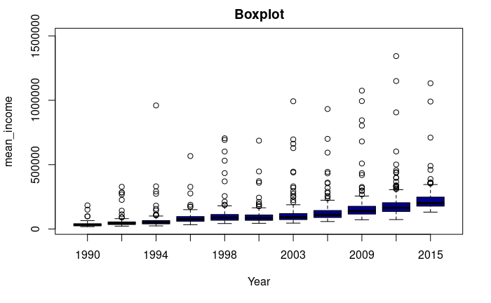

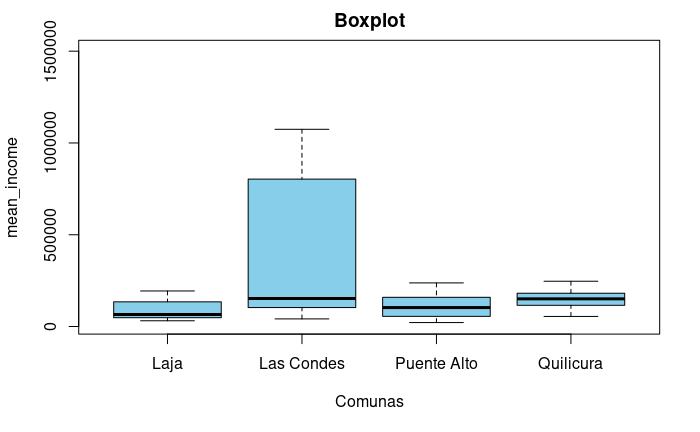

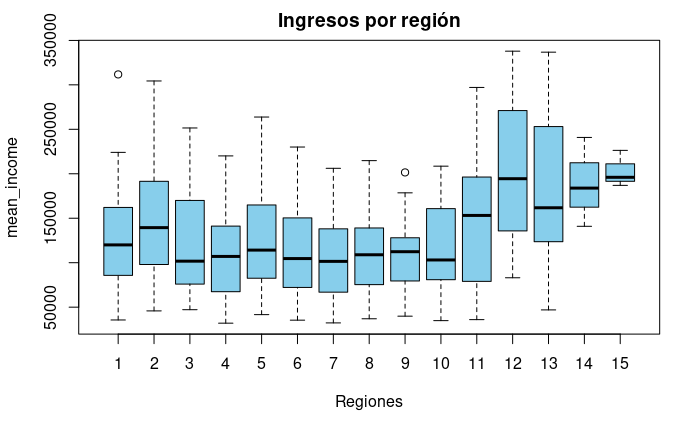

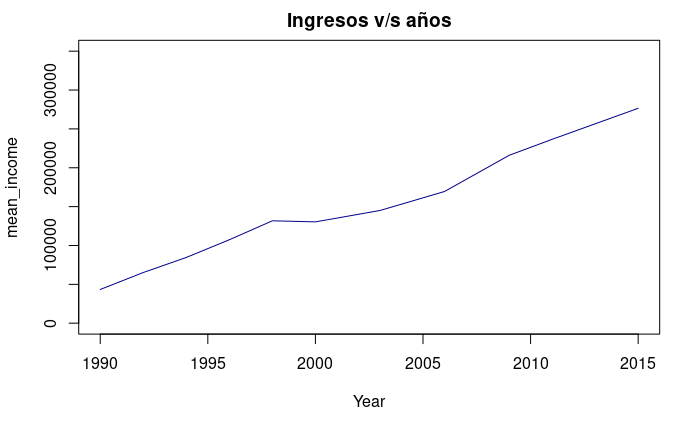


## Salud

**Pre Procesamiento: ** Los datos recopilados se encontraban en 4 bases de las cuales 3 correspondían a los identificaciones de la primera, fue necesario también agregar una base de datos extra con las identificaciones de regiones y comunas, todas las bases fueron unificadas mediante el comando merge y según las llaves necesarias. 

No se encontraron datos inexistentes o inconsistentes en esta base de datos.


**Dimensión y estadísticos : ** La base de datos del plan de salud de la encuesta CASEN consiste en 1746044 filas y 11 columnas, de las cuales consideraremos principalmente:

1. Año en que se recopila la información (year)
2. Sistema de salud del encuestado (health_system)
3. Región del encuestado (region_name)
4. Comuna del encuestado (comuna_name)

  
| Año                    | Plan de Salud    | Región                | Comuna              |
| ---------------------- | ---------------  | --------------------- | ------------------- |
| 2000: 248525           | Fonasa A: 639316 | Metropolitana: 330806 | Arica: 27222        |
| 2003: 254456           | Fonasa B: 445391 | Bío Bío: 259047       | Antofagasta: 25108  | 
| 2006: 268659           | Fonasa C: 183766 | Valparaíso: 171187    | Iquique: 24030      |
| 2009: 246924           | Isapre: 163925   | Araucanía: 151506     | Copiapó: 22823      |
| 2011: 294791           | Fonasa D: 128417 | Maule: 145793         | Valdivia: 20106     |
| 2013: 218491           | Ninguno: 81272   | O'Higgins: 129199     | Punta Arenas: 17355 |
| 2015: 214198           | (Other): 103957  | (Other): 558506       | (Other): 1609400    |

El resto de características no eran relevantes para nuestro proyecto.

**Análisis temporal: ** Consideraremos la evolución de la cantidad de personas que poseen determinados planes de salud a lo largo de los años y a través de las distintas regiones y comunas, las gráficas se presentan a continuación:

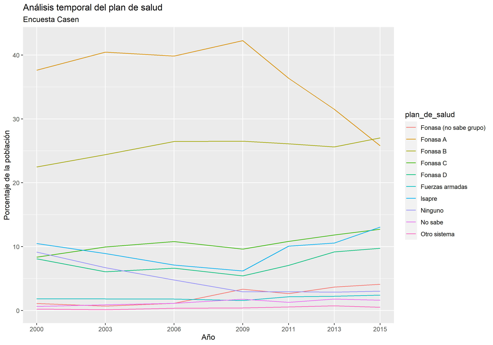
Podemos ver que el plan Fonasa A ha estado predominando a lo largo de los años hasta el año 2009 donde comenzó a sufrir una baja importante, el plan FONASA B se ha mantenido constante y por sobre el resto de los planes que no han sufrido muchos cambios. Cabe destacar que el plan ISAPRE también comenzó a subir de manera sustancial a partir del año 2009. 

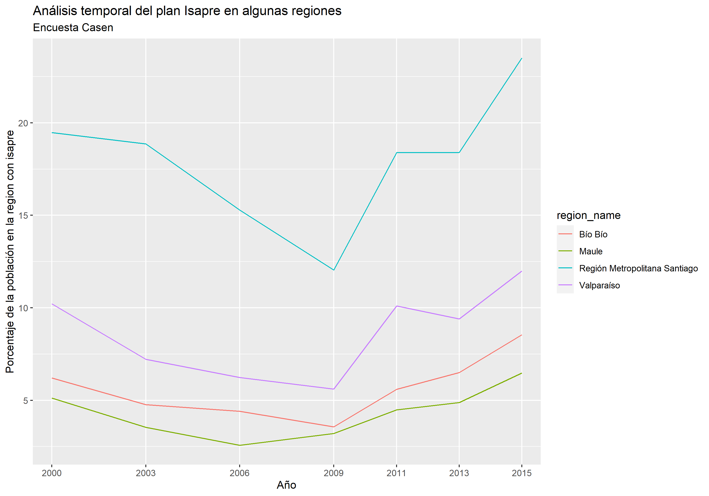
Se consideraron también análisis con respecto al plan ISAPRE pues corresponde al más caro de los planes y podría ser un buen indicador del nivel de ingresos que tiene una determinada comuna/región. Como es de esperar, en la región Metropolitana gran parte de la población posee este plan mientras que en otras regiones la cantidad disminuye, esto podría ser un indicador de la concentración de riquezas a lo largo de Chile.

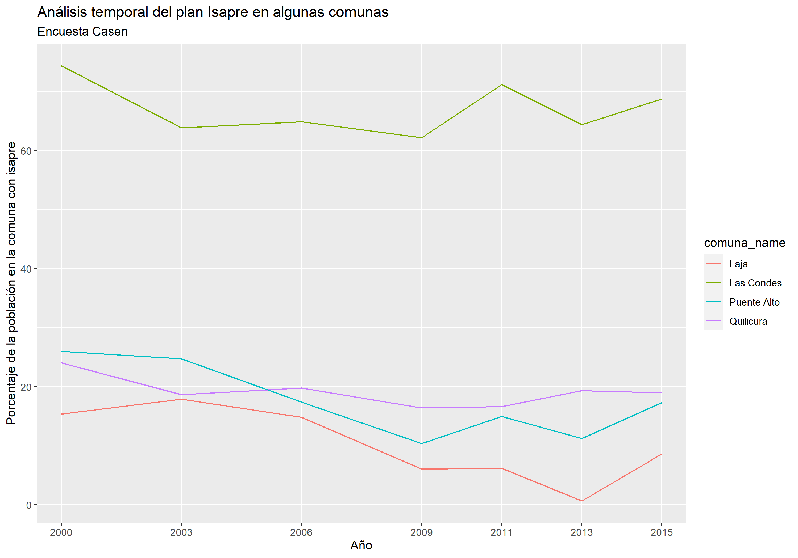
Finalmente, podemos considerar un análisis más fino sobre las comunas, consideramos las comunas de los integrantes del grupo más la región de Las Condes pues se presume mostrarán diferencias considerables. Notar que en Las Condes la mayor parte de la población tiene ISAPRE mientras que en comunas de ingresos menores, este porcentaje disminuye, peor es el caso de comunas en regiones fuera de la Metropolitana. 

Un dato prometedor con respecto a este análisis es el cambio que ocurrió en el año 2009 y esperamos poder relacionar la situación país con este fenómeno. También fue interesante notar que mediante el plan de salud, se pueden ver diferencias considerables al ingreso promedio. 

## Vivienda
**Pre Procesamiento: ** En cuanto a los datos de vivienda lo primero que se realizó fue cambiar las ids de las comunas por sus nombres los cuales se encontraban en otra base de datos, sin embargo, solo habían 90 nombres asociados a 90 ids de un total de 346 comunas existentes en Chile. Lo mismo se realizo con la columna de 'zone_id' en donde se reemplazo la id según fuera una comuna urbana o rural.

Posteriormente se procedió a eliminar las filas de las comunas que no poseen un nombre asociado a sus ids y se busco el nombre de las columnas que poseen algún NA en alguna entrada, para las cuales se reviso que significaban sus ids y se reemplazaron los NA con la id correspondiente a 'Sin Dato'. 

**Dimensión y estadísticos : ** Post pre-procesamiento el dataset resulto en 207695 filas y 46 columnas. Cada fila representa una vivienda encuestada y cada columna una pregunta de la encuesta (a excepción de las 3 primeras que representan la región, comuna y el tipo de zona en que se encuentra la vivienda).

De estas 43 columnas las más importantes y que guardan relación con la motivación de este proyecto son; "household_type" (tipo de vivienda); "walls_material", "floor_material", "ceiling_material" (materiales de la vivienda); "household_sq_meters" (metros cuadrados); "household_using" (origen de la vivienda usada); "subsidy_or_program" (programa de subsidio); "credit" (crédito hipotecario usado); "paying_credit" (estado del pago del crédito); "water_distribution" (distribución del agua); "waste_disposal" (tipo de baños); "rooms" (habitaciones); "bathrooms" (baños); "families_in_household" (familias en la vivienda); "less_than_8_blocks_public_transport" (transporte publico a menos de 8 cuadras); "less_than_20_blocks_educational_center" (centro educacional a menos de 20 cuadras); "less_than_20_blocks_health_center" (centro médico a menos de 20 cuadras); "less_than_20_blocks_pharmacy" (farmacia a menos de 20 cuadras).

Como la mayoría de los atributos de este dataset son de tipo cualitativo (categóricos), solo se pueden extraer estadísticas en base a las frecuencias de las categorías, a continuación se muestran algunas visualizaciones de gráficos de barras a nivel comunal, regional y por tipo de zona para algunos de los atributos más importantes en base a la motivación del proyecto:

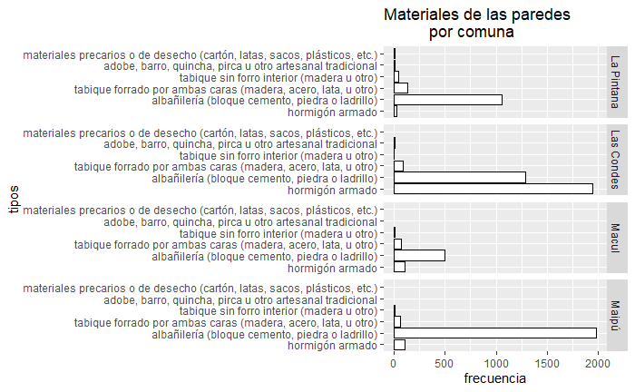
En la visualización anterior resulta interesante notar que en la comuna de Las Condes predomina el hormigón armado en las construcciones y casi no hay viviendas con tabique armado, mientras que en las otras comunas predomina la abañilería.

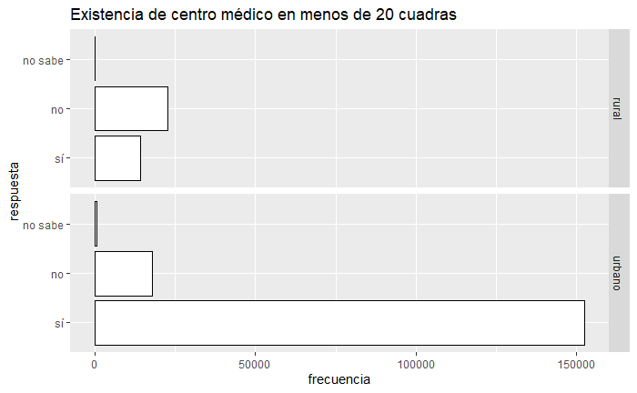
En esta visualización se puede notar los problemas que sufren las viviendas rurales en el ámbito de salud, en dodne la amyoria de ellas no tiene centros médicos en menos de 20 cuadras y comunmente deben desplazarse grandes distancias para llegar a alguno.


En esta última visualización se puede ver que en la Región Metropolitana a diferencia de otras regiones existe un gran uso del subsidio habitacional con y sin crédito, mientras que en las regiones suele predominar tener viviendas en un sitio con recursos propios.

Además de estos gráficos de barras para distintos atributos, se pueden obtener tablas de contingencia entre dos o más atributos que permiten analizar la relación entre ellas. En la siguiente tabla se muestra la tabla de contingencia entre los atributos del tipo de material de las paredes y el tipo de material del suelo de las viviendas:

|                   | material de las paredes |       |       |      |      |    |
|-------------------|-------------------------|-------|-------|------|------|----|
| material del piso | 1                       | 2     | 3     | 4    | 5    | 6  |
| 1                 | 9610                    | 16263 | 40186 | 2418 | 2036 | 19 |
| 2                 | 12425                   | 73880 | 25429 | 1013 | 1208 | 0  |
| 3                 | 1306                    | 1542  | 2093  | 89   | 40   | 0  |
| 4                 | 489                     | 4875  | 2440  | 405  | 467  | 24 |
| 5                 | 361                     | 3788  | 3508  | 784  | 669  | 36 |
| 6                 | 0                       | 5     | 59    | 64   | 106  | 58 |
En donde las categorias de los materiales de las paredes son; 1. "hormigón armado"; 2. "albañilería (bloque cemento, piedra o ladrillo)"; 3. "tabique forrado por ambas caras (madera, acero, lata, u otro)"; 4. "tabique sin forro interior (madera u otro)"; 5. "adobe, barro, quincha, pirca u otro artesanal tradicional"; 6. "materiales precarios o de desecho (cartón, latas, sacos, plásticos, etc.)". Mientras que las categorias del material del suelo son; 1. "parquet, madera, piso flotante o similar"; 2. "cerámico, porcelanato, flexit o similar"; 3. alfombra o cubrepiso; 4. baldosa de cemento; 5. radier; 6. tierra.

Como se puede ver, existe completa correlación entre los materiales premium utilizados, teniendo que las viviendas con hormigon armado suelen tener piso flotante o cerámico. Mientras que por otra parte las viviendas con piso tipo radier suelen ser de albañilería y tabique.

## Datos Bancarios

El análisis de bancarización forma parte de la encuesta de caracterización económica y social, la cual contiene un set de temas financieros, lo cual permite analizar en términos generales la evolución de la bancarización a nivel regional y comunal en Chile, con la posibilidad de contrastar los datos con respecto a los años 2011, 2013 y 2015. Los datos muestran una evolución global de la bancarización chilena de acuerdo a las siguientes características:

Tarjeta de Débito: Si la persona encuestada posee o no Tarjeta de Débito (debit_card_id)
Tarjeta de Crédito: Si la persona encuestada posee o no Tarjeta de de alguna entidad Bancaria (credit_card_bank_id)
Tarjeta de Retail: Si la persona encuestada posee o no Tarjeta de alguna entidad de tipo Retail (credit_card_store_id)
Chequera: Si la persona encuestada posee o no Chequera (checks_id)
Línea de Crédito: Si la persona encuestada posee o no Línea de Crédito (credit_line_id)

| Año           | Región                      | Comuna            | Datos                      |
|---------------|-----------------------------|-------------------|----------------------------|
| 2011: 105821  | Región Metropolitana: 69982 | Quilicura: 2329   | Credit_card_bank: 54886    |
| 2013: 119802  | Región de Valparaíso: 35602 | Puente Alto: 7034 | Debit_card: 164680         |
| 2015: 158449  | Región del Biobío: 44270    | Las Condes: 4822  | Credit_card_retail: 120877 |
|               | Región del Maule: 24227     | Laja: 935         | Checks: 32991              |
|               |                             |                   | Credit_card_line: 32221    |

En cuanto a la exploración, se realizó un enfoque de 3 aspectos principales buscando caracterizar la cantidad de personas que poseen algún tipo de productos financiero con a lo largo de los años, diferenciar la cantidad de personas que utilizan los diferentes productos y por último cómo se caracterizan comunas de diferente status social en el uso de los diferentes productos bancarios. Para esto se realizó una exploración dentro del data modificando sus características de tal manera que se pudiesen filtar y contar los datos necesarios para la exploración. Así, se obtuvieron los siguientes resultados visuales: 


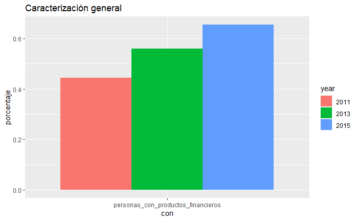

Con esto es posible ver la curva de crecimiento que tiene la posesión de productos financieros a lo largo de los años. Además se tiene que la bancarización en Chile ya mantiene niveles medio-altos al contar con cerca del 67% de la población con algún tipo de producto bancario para su uso personal.


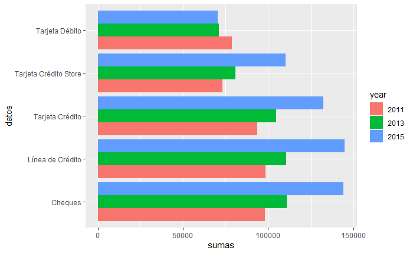

Dentro de este gráfico es posible realizar varias visualizaciones, y para esto podemos ordenar las caracterizaciones:
-Tarjeta Débito: Es posible ver que resulta ser el producto más utilizado y con mayor tasa de crecimiento con respecto a su uso. Para el 2015, ya casi el 56% de la población analizada cuenta con tarjeta débito, las cuales sirven generalmente para realizar compras y pagos al contado sin la necesidad de portar efectivo.
-Tarjeta Crédito: Este producto cuenta con un desarrollo mucho menor al que muestra la tarjeta débito, puesto que no llega a alcanzar nisiquiera el 20% de uso en la población chilena, pero aún así cuenta con un aumento en sus tasas de uso no menor a lo largo de los años.
-Tarjeta Retail: Esta tarjeta aporta con un gran porcentaje de uso en chile según los datos, entendiendo que las personas que adquieren tarjetas de crédito tienden a preferir las del sector Retail más que la de entidades Bancarias. Cabe destacar además que la tarjeta Retail cuenta con un comportamiento totalmente diferente al del resto de los productos en cuanto a su desarrollo a lo largo de los años, el cual podría valer la pena de estudiar, dado su particularidad.
-Chequera: La chequera cuenta con un porcentaje de uso bastante bajo en la población lo cual puede estar de alguna manera relacionado a la preferencia que tienen las personas a la tarjeta de débito como remplazo al pago en contado del efectivo y los cheques. Dado el desarrollo y crecimiento de las tarjetas de débito, se podría esperar que las chequeras comiencen a decaer sus porcentajes de uso en algún momento.
-Línea de Crédito: Junto con las chequeras, la línea de crédito se caracteriza por ser un producto de muy bajo uso en la población, lo cual puede estar ligado a algún factor de limitación o de preferencias de los chilenos.


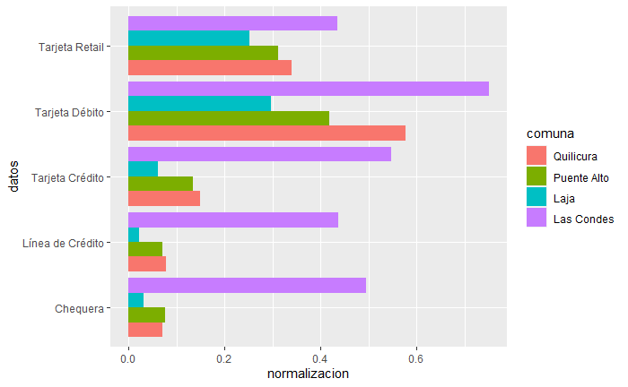

Por último, esta caracterización visual permite inferir diferentes características: 
-En primer lugar es claro que la utilización de productos bancarios en general, vista en la primera imagen, se puede relacionar directamente con las comunas de mayores ingresos.
-Otra característica importante a destacar es la gran diferencia que existe entre la comuna de las condes y el resto con respecto al uso de Tarjetas de Crédito, Líneas de Crédito y Chequeras, dando a entender que el uso de ellas se podría encontrar limitado por ciertas características económicas imporantes.
-En las tarjetas de crédito retail y tarjetas de débito es posible ver unos porcentajes no tan cesgados de uso como el resto de los productos, pudiendo explicar la globalización que está alcanzando el uso y desarrollo de estos dos productos a nivel regional (lo cual también se podría extender a nivel nacional).

# Preguntas y Problemas


* **¿Existe alguna relación entre el ingreso promedio de una comuna y el plan de salud mayoritario de la misma? Y de ser así, ¿Que relación guardan?**

* **¿Qué relación existe entre la región y ingresos/salud/vivienda/banco??**

* **¿Qué cambios se han evidenciados a largo de los años?**

* **¿Qué sucedió el 2009 que produjo el cambio en la distribución de planes de salud?**

* **¿Qué variables se puede relacionar las tendencias que se tengan a lo largo de los años sobre la disminución o aumento de tarjetas de créditos/débito?**

* **¿Qué variables pueden medir de mejor forma la inequidad del país?**


# Contribuciones

| Integrantes     | Aporte en el proyecto (Hito 1)                                                                                                                    |
|-----------------|---------------------------------------------------------------------------------------------------------------------------------------------------|
| Nicolás Gatica  | Análisis de datos bancarios (tablas y gráficas) , confección del reporte general sección bancaria y  búsqueda del dataset, video de presentación. |
| Cristóbal Igor  | Análisis de datos de vivienda (tablas y gráficas), confección del reporte general sección vivienda y búsqueda del dataset, video de presentación. |
| Nelson Moreno   | Análisis de datos de salud (tablas y gráficas) , confeción del reporte general sección salud y  búsqueda del dataset, video de presentación       |
| Emilio Roa      | Análisis de datos de ingreso (tablas y gráficas) , confección del reporte sección ingreso y búsqueda del dataset, video de presentación.          |
| Thomas Waldura  | Confección de la presentación (diapositivas), confección del reporte sección introducción y  búsqueda del dataset.                                |


# Códigos de fuente utilizado para generar sus estadísticas y análisis

### Dataset Ingresos
```{r}
#Cargar Datasets Ingresos
library(readr)

df_ingresos_comunas<-read_csv("../dataset/comuna_data_all.csv")
df_ingresos_region<-read_csv("../dataset/region_data_all.csv")
df_ingresos_country<-read_csv("../dataset/country_data_all.csv")

comunas_id<- read_csv("../dataset/2017_06_27_comunas_datachile_fixed.csv")
```

```{r}
#Dimensiones de los datasets
dim(df_ingresos_comunas)
dim(df_ingresos_region)
dim(df_ingresos_country)
```

```{r}
#Se crea la columna con los nombres de las comunas y se reemplaza por "geography_id"
library(tidyverse)
df_nombres_comunas<-comunas_id[c('comuna_datachile_id','comuna_name')]
df_nombres_comunas<-df_nombres_comunas[order(df_nombres_comunas$'comuna_datachile_id'),]
df_nombres_comunas<-rename(df_nombres_comunas, geography_id=comuna_datachile_id)

df = merge(x = df_nombres_comunas, y = df_ingresos_comunas, by = "geography_id")
df <- select(df, -geography_id) 

summary(df)
```

```{r}
#comuna_data_all
filtro <- df %>%
    filter((df$comuna_name == 'Las Condes' | df$comuna_name=='Laja') | (df$comuna_name== 'Quilicura') | df$comuna_name== 'Puente Alto') 

boxplot(df$weighted_mean_income ~ df$year,ylim=c(18000,1500000), xlab = 'Year' , ylab = 'mean_income',main="Boxplot",col='dark blue')

boxplot(filtro$weighted_mean_income ~ filtro$comuna_name,ylim=c(18000,500000), xlab = 'Comunas' , ylab = 'mean_income',main="Boxplot",col='sky blue')

boxplot(filtro$weighted_mean_income ~ filtro$comuna_name,ylim=c(18000,1500000), xlab = 'Comunas' , ylab = 'mean_income',main="Boxplot",col='sky blue')
```

```{r}
#df_ingresos_region
filtro <- df_ingresos_region %>%
    filter(df_ingresos_region$geography_id == 8 )

boxplot(df_ingresos_region$weighted_mean_income ~ df_ingresos_region$year, xlab = 'Year' , ylab = 'mean_income',main="Ingresos v/s años",col='dark blue')

boxplot(df_ingresos_region$weighted_mean_income ~ df_ingresos_region$geography_id, xlab = 'Regiones' , ylab = 'mean_income',main="Ingresos por región",col='sky blue')
```

```{r}
#df_ingresos_country
plot(df_ingresos_country$weighted_mean_income ~ df_ingresos_country$year,ylim=c(0,350000), xlab = 'Year' , ylab = 'mean_income',main="Ingresos v/s años",col='dark blue',type='l')
```

### Dataset Salud

```{r}
library(readr)
#Iimportamos los dataset de salud 
healthsystem <- read_csv("~/GitHub/fondaMinera/dataset/healthsystem.csv")
healthsystem_ids <- read_csv("~/GitHub/fondaMinera/dataset/healthsystem_ids.csv")
healthsystemgroup_ids <- read_csv("~/GitHub/fondaMinera/dataset/healthsystemgroup_ids.csv")
comunas <- read_csv("~/GitHub/fondaMinera/dataset/2017_06_27_comunas_datachile_fixed.csv")
```

```{r}
#Unificamos las id's en el dataset global 
temp1 <- merge(x = healthsystem, y = healthsystem_ids, by = "health_system_id")
temp2 <- merge(x = temp1 , y = comunas , by= "comuna_datachile_id")
#Eliminamos las columnas con las id's que no sirven 
sistema_salud <- temp2[,-c(1,2,12,14,15)]
#Eliminamos las variables del sistema 
remove(temp1, temp2, healthsystem, healthsystem_ids , healthsystemgroup_ids , comunas)
#Cambiamos el nombre de esta variable
sistema_salud[sistema_salud$health_system == 'Fuerzas Armadas, de Orden y Seguridad Pública',4] <- 'Fuerzas armadas'
```

```{r}
#Cambiamos el tipo de dato de ciertas columnas
sistema_salud$year = as.factor(sistema_salud$year)
sistema_salud$region_name = as.factor(sistema_salud$region_name)
sistema_salud$comuna_name = as.factor(sistema_salud$comuna_name)
sistema_salud$health_system = as.factor(sistema_salud$health_system)
head(sistema_salud)
```

```{r}
#Algunos datos
dim(sistema_salud) #La dimensión es de 1746044 x 11
sum(is.na(sistema_salud)) #No hay valores NA 
summary(sistema_salud)
```

```{r}
#Veamos la evolución de las distintas fonasas a lo largo de los años 
library(dplyr)
plan_salud <- sistema_salud[,c(1,4,9,10)]
plan_salud_ano <- plan_salud %>%
  group_by(plan_salud$year,plan_salud$health_system) %>%
  count() %>% 
  rename(ano = `plan_salud$year` , plan_de_salud = `plan_salud$health_system`)
head(plan_salud_ano)
```

```{r}
#Frecuancia relativa 
sum_2000 <-sum(plan_salud_ano$n[plan_salud_ano$ano=='2000'])
sum_2003 <-sum(plan_salud_ano$n[plan_salud_ano$ano=='2003'])
sum_2006 <-sum(plan_salud_ano$n[plan_salud_ano$ano=='2006'])
sum_2009 <-sum(plan_salud_ano$n[plan_salud_ano$ano=='2009'])
sum_2011 <-sum(plan_salud_ano$n[plan_salud_ano$ano=='2011'])
sum_2013 <-sum(plan_salud_ano$n[plan_salud_ano$ano=='2013'])
sum_2015 <-sum(plan_salud_ano$n[plan_salud_ano$ano=='2015'])
#Definimos una función para aplicarlo sobre las sumas 
relativa <- function(año,n){
  if(año == '2000'){
      return(n/sum_2000*100)
  }
  if(año == '2003'){
      return(n/sum_2003*100)
  } 
  if(año == '2006'){
      return(n/sum_2006*100)
  } 
  if(año == '2009'){
      return(n/sum_2009*100)
  } 
  if(año == '2011'){
      return(n/sum_2011*100)
  } 
  if(año == '2013'){
      return(n/sum_2013*100)
  } 
  if(año == '2015'){
      return(n/sum_2015*100)
  } 

}
plan_salud_ano$porcentaje <- mapply(relativa,plan_salud_ano$ano , plan_salud_ano$n)
head(plan_salud_ano)

```

```{r}
#Ahora ploteamos 
#un pequeño ajuste al año
plan_salud_ano$ano <- as.numeric(as.character(plan_salud_ano$ano))
#ahora ploteamos
library(ggplot2)
ggplot(data = plan_salud_ano , aes(x = ano , y = porcentaje , color = plan_de_salud)) + 
  geom_line() + 
  labs(title ="Análisis temporal del plan de salud", subtitle = "Encuesta Casen", x = "Año" , y= "Porcentaje de la población") + 
  scale_x_discrete(limits=c(2000, 2003, 2006,2009,2011,2013,2015))+
  ggsave("plan_salud_ano.png" , path = "../img/",width=10)
  
```

```{r}
comuna1 <- 'Quilicura'
comuna2 <- 'Puente Alto'
comuna3 <- 'Las Condes'
comuna4 <- 'Laja'
  
isapre <- sistema_salud[sistema_salud$health_system == 'Isapre',c(1,4,10,11)]
#veamos el caso particular de puente alto, quilicura y las condes 
isapre_comuna <- isapre %>%
  filter(comuna_name == comuna1 | comuna_name == comuna2 | comuna_name == comuna3 | comuna_name == comuna4) %>%
  group_by(year,comuna_name) %>%
  count()
#Este es el plan de todos los de esas comunas
todosplanes <- sistema_salud[,c(1,4,10,11)]
todosplanes_comuna <- todosplanes %>%
  filter(comuna_name == comuna1 | comuna_name == comuna2 | comuna_name == comuna3 | comuna_name == comuna4) %>%
  group_by(year,comuna_name) %>%
  count()

isapre_comuna$relativo <- isapre_comuna$n/todosplanes_comuna$n * 100

```

```{r}
#Ahora ploteamos 
#un pequeño ajuste al año
isapre_comuna$year <- as.numeric(as.character(isapre_comuna$year))
#ahora ploteamos
ggplot(data = isapre_comuna , aes(x = year , y = relativo , color = comuna_name)) + 
  geom_line() + 
  labs(title ="Análisis temporal del plan Isapre en algunas comunas", subtitle = "Encuesta Casen", x = "Año" , y= "Porcentaje de la población en la comuna con isapre") + 
  scale_x_discrete(limits=c(2000, 2003, 2006,2009,2011,2013,2015)) + 
  ggsave("plan_salud_ano_comunas.png" , path = "../img/",width=10)
  
```

```{r}
region1 <- 'Valparaíso'
region2 <- 'Región Metropolitana Santiago'
region3 <- 'Maule'
region4 <- 'Bío Bío'
  
#veamos el caso particular delas regiones metropolitana, valparaiso, biobio, maule 
isapre_region <- isapre %>%
  filter(region_name == region1 | region_name == region2 | region_name == region3 | region_name == region4) %>%
  group_by(year,region_name) %>%
  count()
#Este es el plan de todos los de esas comunas
todosplanes_region <- todosplanes %>%
  filter(region_name == region1 | region_name == region2 | region_name == region3 | region_name == region4) %>%
  group_by(year,region_name) %>%
  count()

isapre_region$relativo <- isapre_region$n/todosplanes_region$n * 100

```

```{r}
#Ahora ploteamos 
#un pequeño ajuste al año
isapre_region$year <- as.numeric(as.character(isapre_region$year))
#ahora ploteamos
ggplot(data = isapre_region , aes(x = year , y = relativo , color = region_name)) + 
  geom_line() + 
  labs(title ="Análisis temporal del plan Isapre en algunas regiones", subtitle = "Encuesta Casen", x = "Año" , y= "Porcentaje de la población en la region con isapre") + 
  scale_x_discrete(limits=c(2000, 2003, 2006,2009,2011,2013,2015)) + 
  ggsave("plan_salud_ano_region.png" , path = "../img/",width=10)
  
```

### Prepocesamiento Datos Bancarios
```{r}
library(readr)
library(dplyr)
library(tidyverse)
library(ggplot2)

banking_products <- read_csv("~/GitHub/fondaMinera/dataset/banking_products.csv")
banking_products_id <- read_csv("~/GitHub/fondaMinera/dataset/banking_products_id.csv")
comunas <- read_csv("~/GitHub/fondaMinera/dataset/2017_06_27_comunas_datachile_fixed.csv")

dim(banking_products) #La dimensión es de 527089 x 9
sum(is.na(banking_products)) #No hay valores NA 
summary(banking_products)
```

```{r}
#Unificamos las id's en el dataset general
temp <- merge(x = banking_products , y = comunas , by= "comuna_datachile_id")
#Eliminamos las columnas con las id's de las que no tomaremos uso
sistema_bancario <- temp[,-c(1,10,12,13)]
#Eliminamos las variables del sistema que no utilizaremos
remove(temp, banking_products, banking_products_id, comunas)
```

```{r}
#Algunos datos
dim(sistema_bancario) #La dimensión es de 527089 x 10
sum(is.na(sistema_bancario)) #No hay valores nan 
summary(sistema_bancario)
```

```{r}
#No existen valores nan dentro del dataframe, pero por inferencia es posible identificar que ciertos valores etiquetados son nan con una etiqueta numérica, es por esto que lo cambiamos para poder eliminarlos.

#Transformación de los datos que no cuentan con información útil según su etiqueta
sistema_bancario$debit_card_id[sistema_bancario$debit_card_id == 0] <- NA
sistema_bancario$credit_card_bank_id[sistema_bancario$credit_card_bank_id == 0] <- NA
sistema_bancario$credit_card_store_id[sistema_bancario$credit_card_store_id == 0] <- NA
sistema_bancario$credit_line_id[sistema_bancario$credit_line_id == 0] <- NA
sistema_bancario$checks_id[sistema_bancario$checks_id == 0] <- NA

#Eliminación de datos tipo nan
sistema_bancario <- na.omit(sistema_bancario) 
dim(sistema_bancario) #La dimensión sin la valores nan es de 384072 x 10
```

```{r}
#Cambiamos el tipo de dato de ciertas columnas
sistema_bancario$year = as.factor(sistema_bancario$year)
sistema_bancario$region_name = as.factor(sistema_bancario$region_name)
sistema_bancario$comuna_name = as.factor(sistema_bancario$comuna_name)

head(sistema_bancario)
```

```{r}
#Cantidad de datos que ofrecen los diferentes años
total2011 <- sum(sistema_bancario$year == 2011) #
total2013 <- sum(sistema_bancario$year == 2013) #
total2015 <- sum(sistema_bancario$year == 2015) #

# Contribuciones

# Referencias

Ministerio de Desarrollo Social (MDS), Encuesta de caracterización Socioeconómica Nacional (CASEN) 1990-2015, recuperado de [datachile.io](https://es.datachile.io/about/data).
